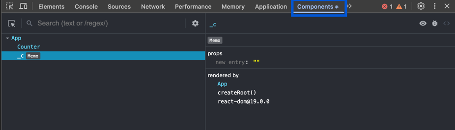
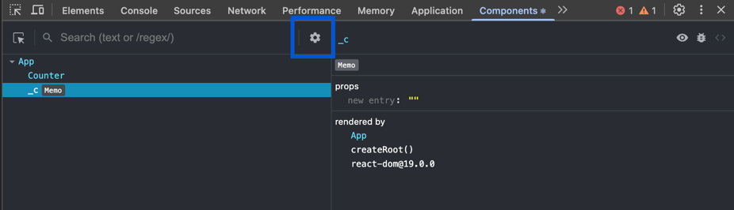
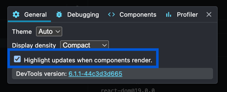

# React useState parents rerender children playground

This is a playground to test how React's `useState` works with parent and children components.

## How to run

1. Clone this repository
2. Run `npm install`
3. Run `npm dev`
4. Open `http://localhost:5173` in your browser
5. Open React Dev Tools Components view 
6. Click on the settings button 
7. Check "Highlight updates when components render" 
8. Click on the `count is 0` button
9. See how the whole tree is re-rendered
10. Click on the `test count count is 0` button and see how only the `Counter` component is re-rendered
